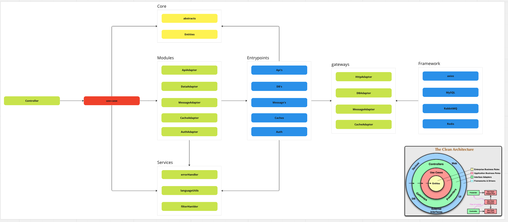

# NestJs + Clean Arch

This project's to apply a concept about clean arch within NestJs. 

## Big Picture

## Folders and responsibilities

- **Core**
  - Has the responsibility on the Business Rule

- **Controllers**
  - Has the responsibility on manage the routes and orchestrate which case-use to use

- **Entry Points**
  - Has the responsibility to know which services our project it has, besides call the layers more externals from project

- **Framework**
  - Has the responsibility by centralizing third-party tools

- **Gateway**
  - Has the responsibility for bridging the _Entry Point_ and _Framework_ layer

- **Module**
  - Has the responsibility for bridging the _Use Case_ and _Entry Point_ layer

- **Use Cases**
  - Has the responsibility of centralizing the rules used by the _Controllers_ layer

- **Const**
  - Has the responsibility to to centralize and organize the public static values as Enum.

- **Utils**
  - Has the responsibility to centralize and organize the public methods of common use to all project

